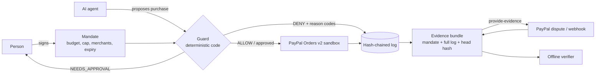

# Agent Flight Recorder

A flight recorder for purchases made by AI agents.

When an AI agent buys something on a person's behalf and the person later
disputes it, nobody can show what the agent was actually allowed to do.
Agent Flight Recorder closes that gap:

1. **Mandate.** The person grants an agent a narrow, expiring permission:
   a budget, a per-order cap, named merchants, allowed categories and a
   maximum number of orders. The mandate is signed, so it cannot be edited
   afterwards.
2. **Guard.** Every purchase the agent proposes is checked against the
   mandate by plain, deterministic code before any PayPal order is created.
   The verdict is allow, deny, or ask the person first, with reason codes.
3. **Recorder.** Every step is written to an append-only, hash-chained log,
   so later edits to the record are detectable.
4. **Evidence.** If the buyer disputes the purchase, the mandate and the log
   are assembled into evidence and submitted through PayPal's Disputes API.

Built for the PayPal AI Hackathon. Sandbox only; no real money moves.

## How it works



## Status

| Part | State |
|---|---|
| Signed mandates (Ed25519, canonical JSON) | Done, tested |
| Guard with reason codes | Done, tested |
| Hash-chained log, derived budget state | Done, tested |
| PayPal client and purchase orchestrator | Done, tested with a fake transport |
| Real PayPal sandbox order (OAuth + Orders v2 create) | Verified, including through the dashboard (`scripts/sandbox_smoke.py`) |
| Evidence bundle + offline verifier | Done, tested with 8 tamper cases |
| Dispute evidence via Disputes API (multipart) | Written to the documented API; tested against a fake transport only. **Not yet run against a real sandbox dispute** (needs a sandbox buyer action) |
| Webhooks (signature verified, idempotent) | Done, tested with a fake transport; not yet registered with PayPal |
| Red-team suite | 27 attack scenarios, 27 blocked (see below) |
| Dashboard and demo server | Done |
| Shopping agent | Scripted proposer always; live-model proposer written, needs `ANTHROPIC_API_KEY` |

Order capture needs a sandbox buyer to approve the order in a browser, so
captured orders and live disputes are not exercised automatically.

## Run it

Requires Python 3.10 or newer.

```bash
python -m venv .venv
# Windows: .venv\Scripts\activate    macOS/Linux: source .venv/bin/activate
pip install -r requirements.txt
python -m pytest                       # all tests
python scripts/redteam_report.py       # red-team block rate
DEMO_PAYPAL=simulated PYTHONPATH=backend python -m flightrecorder.server   # http://localhost:8000
```

On Windows PowerShell use `$env:DEMO_PAYPAL="simulated"; $env:PYTHONPATH="backend"; python -m flightrecorder.server`.
Without `DEMO_PAYPAL=simulated` and with sandbox credentials in `.env`, the
demo creates real PayPal **sandbox** orders; the page shows which mode is active.

## Red-team results

`python scripts/redteam_report.py` runs adversarial scenarios through the real
orchestrator and counts a scenario as blocked only if no PayPal order call was
made beyond a single legitimate one. Current result: **27 of 27 attack
scenarios blocked** (prompt-injected rationale, inflated or under-reported
totals, negative and float prices, lookalike and homoglyph merchants, currency
swap, replay, expiry, revocation, order splitting, forged mandate). Two
scenarios inside the mandate's scope are **not** blocked, on purpose: an
overpriced but permitted item at an allowed merchant, and injected text in an
item name on an otherwise valid order. The mandate allowed those purchases.

Caveat: the scenarios were written by the same author as the guard, so this
is a regression suite, not independent testing.

## Configuration

Copy `.env.example` to `.env` and fill in your own PayPal sandbox client ID
and secret from the PayPal developer dashboard. `.env` is ignored by git.

## Design notes

- **No AI model in the enforcement path.** A model proposes a purchase; the
  guard decides. The same inputs always give the same verdict.
- **Money is integer minor units** (cents), never floats, so what was signed
  is exactly what is checked.
- **The guard uses the total computed from the line items**, not the total
  the agent claims.
- **Fail closed.** Anything unverifiable or out of scope is denied.
- **Tamper-evident, not tamper-proof.** A hash chain shows edits to past
  events. Removing the newest events is only detectable against a head hash
  saved somewhere else, which is why the head hash is meant to be published
  outside the database.

## Tools used

Built with AI assistance (Claude Code). Python standard library, `cryptography`
(Ed25519), SQLite, pytest; PayPal Orders v2, OAuth, Customer Disputes and
Webhooks (sandbox); optional Anthropic Messages API for the demo agent.

## Licence

MIT. See `LICENSE`.
